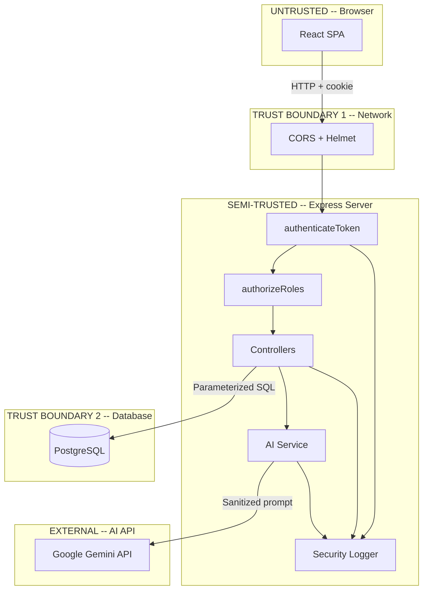

# Architecture, Data Flow & Threat Model — MediConnect Healthcare Platform

---

## 1. Application Overview & Component Inventory

MediConnect is a full-stack healthcare platform designed to facilitate secure patient-doctor communication, appointment scheduling, prescription management, and real-time medical chat. The platform handles electronic Protected Health Information (ePHI) subject to HIPAA compliance.

| Component | Technology | Role & Security Relevance |
|-----------|-----------|---------------------------|
| **Frontend SPA** | React 19, MUI 7, React Router 7 | Client-side presentation layer; route guards are not treated as a security boundary |
| **Backend API** | Express.js 4, Node.js v22 | 40 REST endpoints; enforces authentication, authorization, and rate monitoring |
| **Authentication** | JWT (`jsonwebtoken`), `bcryptjs` | Issues HTTP-only session cookies with 24-hour expiry; bcrypt password hashing (10 salt rounds) |
| **Authorization (RBAC)** | Custom `roleMiddleware.js` | Enforces role-based permissions (`authorizeRoles`) and object-level ownership checks |
| **Database** | PostgreSQL 14 via `pg` Pool | Parameterized queries (`$1, $2`) throughout to eliminate SQL injection |
| **Real-time Chat** | Socket.IO 4 | WebSocket communication channel for doctor-patient real-time messaging |
| **AI Symptom Triage** | Google Gemini 3.6 Flash | Rule-constrained AI assistant with strict regex input sanitization and patient-only access |
| **Security Monitoring** | Custom `securityLogger.js` | Structured JSON security logging, PII masking, and real-time brute-force detection |
| **CI/CD Automation** | GitHub Actions | Automated secret scanning (Gitleaks), SCA (`npm audit`), SAST (Semgrep), and regression tests |

---

## 2. Architecture, Data Flow & Trust Boundaries

The system architecture is structured across five distinct trust domains to ensure defense-in-depth and prevent unauthorized boundary crossing:

### Trust Boundary Definitions

1. **Untrusted Client Domain (Browser):**
   * The React Single Page Application runs on the client device. Client-side state, form fields, and navigation guards are treated as untrusted.
2. **Network Perimeter (Trust Boundary 1):**
   * Enforces CORS restricted to the authorized frontend domain, Helmet HTTP security headers (XSS filter, framing restrictions, HSTS), and HTTP Parameter Pollution (`hpp`) protection.
3. **Application Layer (Semi-Trusted Server):**
   * Every incoming request must pass through `authenticateToken` (cryptographic JWT verification) and `authorizeRoles()` before executing controller logic.
4. **Data Layer (Trust Boundary 2):**
   * PostgreSQL database isolated behind the Express backend. All queries strictly use parameterized statements. Direct client access is prohibited.
5. **External AI Domain:**
   * Google Gemini API. The AI model operates in an isolated environment with zero direct access to application databases, credentials, or internal APIs.

---

## 3. Sensitive Data & ePHI Inventory

The application processes various categories of healthcare information. Each data type has been mapped to storage location, access controls, and HIPAA relevance:

| Data Category | Stored Table / Location | Access Controls | HIPAA Classification |
|---------------|-------------------------|-----------------|----------------------|
| **Patient Demographics** (Name, DOB, Address, Phone, SSN) | `patients` table | JWT auth + Patient ID ownership check | ePHI / Direct Identifiers |
| **Doctor-Patient Chat Messages** | `chat_messages` table | JWT auth + Room membership validation (`userId == idA \|\| idB`) | ePHI / Clinical Communications |
| **Prescriptions & Medication** (Drug, Dosage, Instructions) | `prescriptions` table | Doctor role + Prescribing doctor ownership check | ePHI / Treatment Records |
| **Medical Appointments** | `appointments` table | Role-based + Patient/Doctor ID matching via DB query | ePHI / Clinical Scheduling |
| **Patient Symptoms & Health Logs** | `patient_symptoms` table | JWT auth + Patient record ownership | ePHI / Health Assessment |
| **AI Symptom Assessments** | Response stream only (not persisted) | JWT auth + Patient-only role (`authorizeRoles('patient')`) | Transient ePHI |
| **Authentication Credentials** | `users` table | `bcrypt` hash (10 salt rounds), never returned in responses | Security Sensitive Data |

---

## 4. Threat Model

### Threat Actors & Motivation

| Threat Actor | Motivation | Capabilities | Target Assets |
|--------------|------------|--------------|---------------|
| **Malicious Authenticated Patient** | Access other patients' medical records, modify prescriptions | Legitimate JWT token, parameter tampering via proxy (Burp Suite) | Chat history, prescription endpoints, patient profiles |
| **External Unauthenticated Attacker** | Compromise platform, mass ePHI exfiltration, ransomware | Network scanning, brute-force credential stuffing, prompt injection | Login endpoint, registration API, AI triage service |
| **Compromised Doctor Account** | Unauthorized prescription modifications, mass data viewing | Doctor JWT credentials | Prescriptions table, global patient lists |

### Core Threats & Security Mitigations

1. **Horizontal Privilege Escalation (Chat IDOR — AS-01):**
   * *Threat:* An authenticated patient tampers with the `roomId` parameter in `/api/chat/history/room/:roomId` to read confidential medical chats between other patients and doctors.
   * *Mitigation:* Implemented server-side room ownership verification parsing `idA` and `idB` from `roomId` and validating against `req.user.userId`.
2. **Medical Record Tampering (Prescription IDOR — AS-03):**
   * *Threat:* A malicious user sends `PUT /api/prescriptions/end/:id` to prematurely terminate other patients' active prescriptions, creating direct clinical harm.
   * *Mitigation:* Enforced role middleware (`authorizeRoles('doctor')`) and added `doctor_id = $3` check in the database update statement.
3. **Vertical Privilege Escalation (Admin Self-Registration — AS-06):**
   * *Threat:* An attacker supplies `{"role": "admin"}` in `POST /api/auth/register`, gaining immediate superuser access to view and delete all doctors and patients.
   * *Mitigation:* Whitelisted allowed registration roles strictly to `['patient', 'doctor']`. Admin accounts can only be provisioned via direct database administration.
4. **AI Prompt Injection & Instruction Override:**
   * *Threat:* Malicious input crafted to hijack the Gemini AI system prompt, extract confidential system instructions, or execute Cross-Site Scripting (XSS).
   * *Mitigation:* Multi-layer regex sanitizer (`_sanitizeInput()`) replaces instruction-override phrases with `[FILTERED]`, strips HTML/script tags, and enforces a strict 10-rule system prompt.
5. **Credential Stuffing & Brute-Force Attacks:**
   * *Threat:* Automated dictionary attacks against `/api/auth/login` to guess user credentials.
   * *Mitigation:* Sliding 5-minute window monitoring in `securityLogger.js` that triggers a `CRITICAL` alert upon 5 failed attempts from the same IP address.

---

## 5. Prioritized Attack Surface Analysis

A comprehensive audit of all 40 REST endpoints and 2 WebSocket event handlers was conducted, prioritizing exposure, data sensitivity, and business impact:

| Priority Level | Endpoint Count | Key Target Endpoints | Primary Risk | Post-Remediation Status |
|:---|:---:|:---|:---|:---:|
| **Priority 1: Critical** | 4 | `/api/chat/history/room/:roomId` `/api/prescriptions/end/:id` `/api/chat/unread` `/api/auth/register` | IDOR on ePHI, medical tampering, privilege escalation | **Remediated & Verified** |
| **Priority 2: High** | 5 | `/api/prescriptions/*` `/api/auth/login` `/api/admin/delete/:userId` `/api/ai/symptom-check` | Missing role middleware, brute-force risk, AI boundary bypass | **Remediated & Verified** |
| **Priority 3: Medium** | 6 | `/api/auth/logout` Database SSL configuration CORS development settings | Stolen token lifespan, TLS verification bypass, CSRF | **Documented in Risk Register** |
| **Priority 4: Low / Info** | 5 | `/api/protected` `/api/activity/recent` | Verbose debug response, activity auditing gaps | **Documented in Master Report** |

### Positive Security Controls Confirmed Pre-Assessment
* **Parameterized SQL:** Zero instances of dynamic string concatenation in database queries.
* **Secure Token Handling:** Session tokens delivered exclusively in HTTP-only cookies with `SameSite=Lax`.
* **Password Hashing:** Robust `bcrypt` hashing with salt rounds = 10.
* **Security Middleware:** `helmet` and `hpp` loaded across all Express routes.
